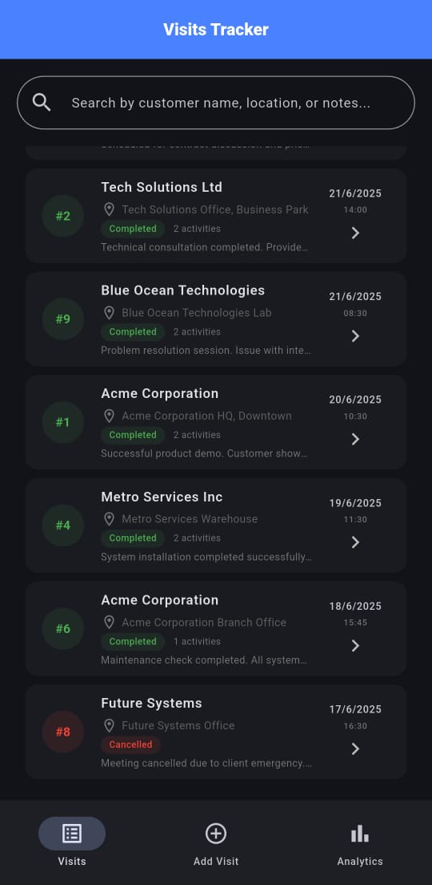
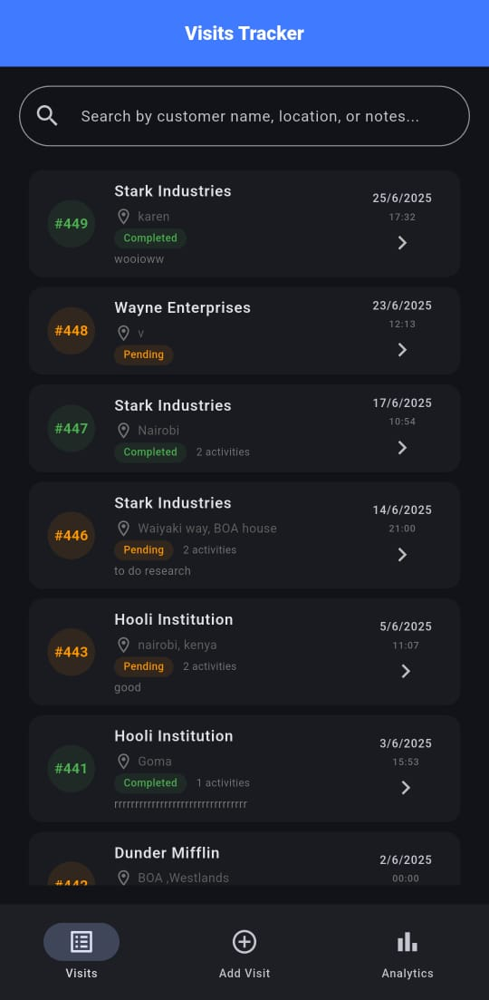
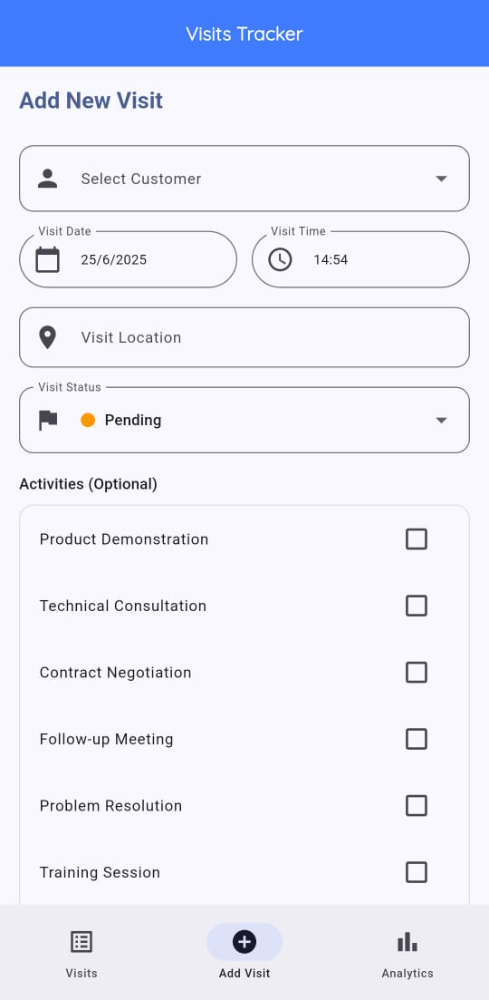
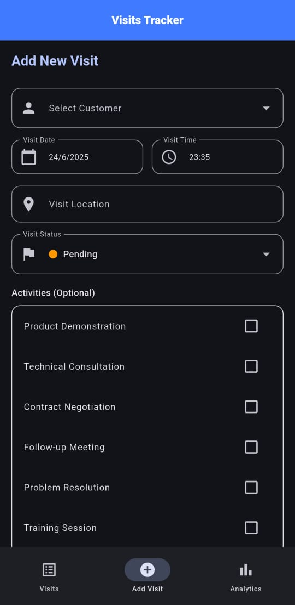
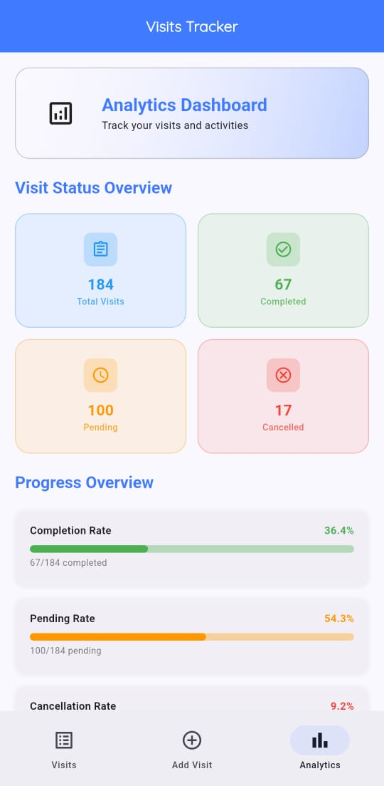
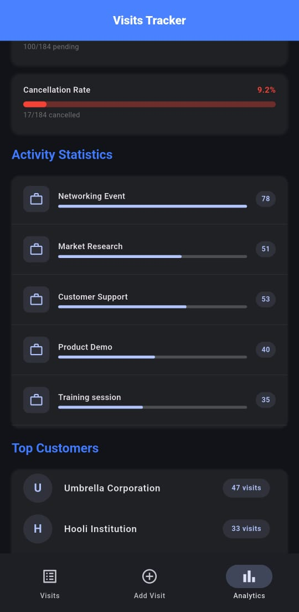
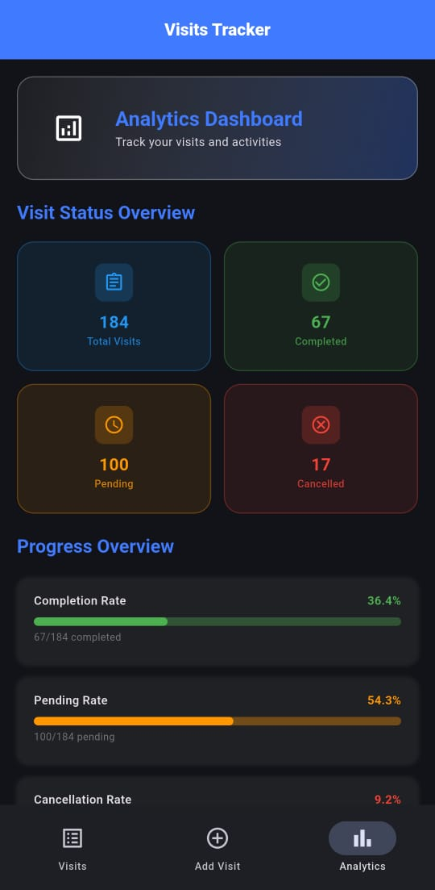
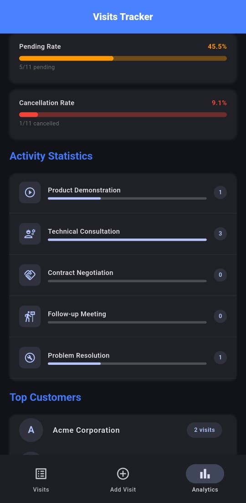

# Events Solutech - Visits Tracker App

A comprehensive Flutter application for tracking customer visits and activities with beautiful analytics.

## 🔗 GitHub Repository

[https://github.com/innocentmayemuhavi/events_solutech](https://github.com/innocentmayemuhavi/events_solutech)

## 🚀 Quick Start

Get the app running in 3 simple steps:

```bash
# 1. Clone the repository
git clone https://github.com/innocentmayemuhavi/events_solutech.git
cd events_solutech

# 2. Install dependencies
flutter pub get

# 3. Run the app
flutter run
```

## 📱 Overview

Events Solutech is a modern Flutter application designed to help businesses track and manage customer visits efficiently. The app provides an intuitive interface for recording visits, managing customer information, and analyzing visit patterns through comprehensive analytics.

### Key Features

- 📋 **Visit Management**: Create, view, and manage customer visits with detailed information
- 📊 **Activity Tracking**: Record specific activities performed during visits
- 📈 **Analytics Dashboard**: Beautiful charts and statistics with progress indicators
- 🌓 **Adaptive Theming**: Supports both light and dark themes following system settings
- 🎨 **Material 3 Design**: Modern UI with consistent design language
- 📱 **Responsive Layout**: Optimized for various screen sizes
- clean code architecture to ensure easy scalling and updating of codebase

## 📸 Screenshots

### Visits List Dark Mode



### Visits List Light Mode



### Add Visit Form Light mode



### Add Visit Form Light mode



### Analytics Light theme



### Analytics dark theme



### Analytics Light theme



### Analytics dark theme



## 🏗️ Architecture & Key Decisions

### State Management

- **Provider Pattern**: Chosen for its simplicity and tight integration with Flutter
- **Separation of Concerns**: Different providers for visits, customers, and activities
- **Reactive UI**: Automatic updates when data changes using `Consumer` widgets to ensure instant update accordingly to data state

## 🎬 Animations & Visual Effects

The app features animations to enhance user experience:

### Animation Types Implemented

#### **Progress Bar Animations**

- **Smooth Progress Bars**: Custom animated progress indicators with rounded corners
- **Staggered Loading**: Progress bars animate with different timing for visual appeal
- **Elastic Curves**: Using `Curves.easeInOut` for natural motion

#### **Card Animations**

- **Scale Animations**: Stats cards animate in with elastic bounce effects
- **Staggered Entrance**: Cards appear with incremental delays (0ms, 100ms, 200ms, 300ms)
- **Transform Scale**: Using `TweenAnimationBuilder` for smooth scaling effects

#### **Page Transitions**

- **Loading States**: Animated loading indicators while data loads

#### **Interactive Elements**

- **List Item Animations**: Smooth animations when adding new visits

## 🔄 CI/CD Implementation

### Overview

This project implements a robust CI/CD pipeline using GitHub Actions to ensure code quality, automated testing, and streamlined deployment processes.

### Implemented Workflows

#### **1. Continuous Integration Pipeline (`ci.yml`)**

Automatically runs on every push to `main`/`develop` branches and all pull requests:

```yaml
# Workflow triggers
on:
  push:
    branches: [main, develop]
  pull_request:
    branches: [main]
```
