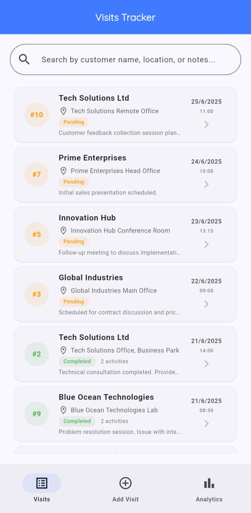
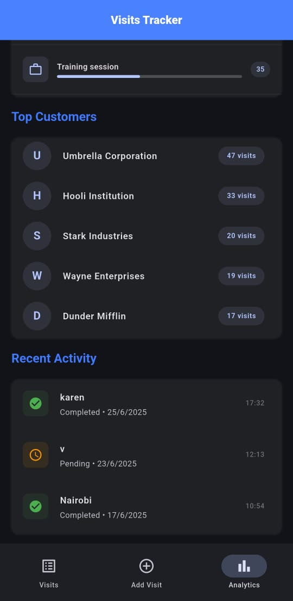
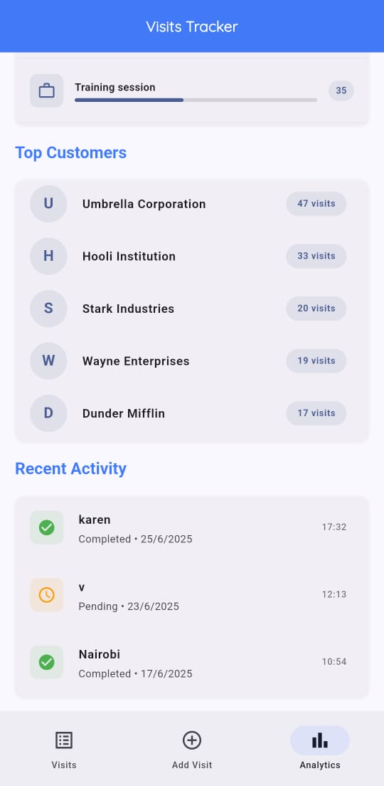
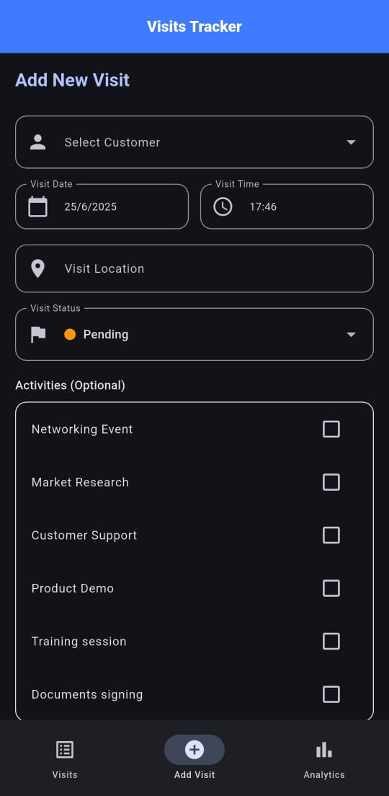
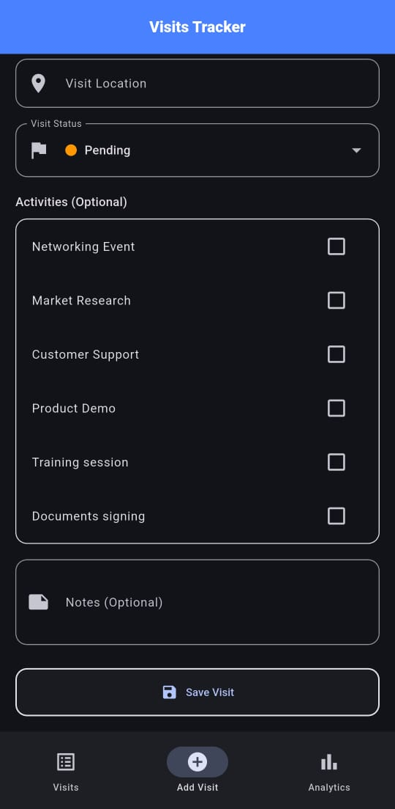
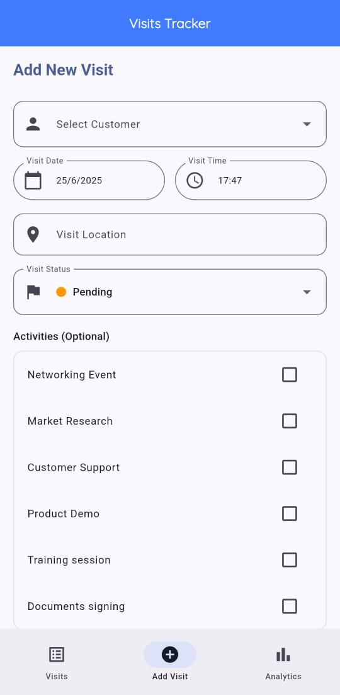
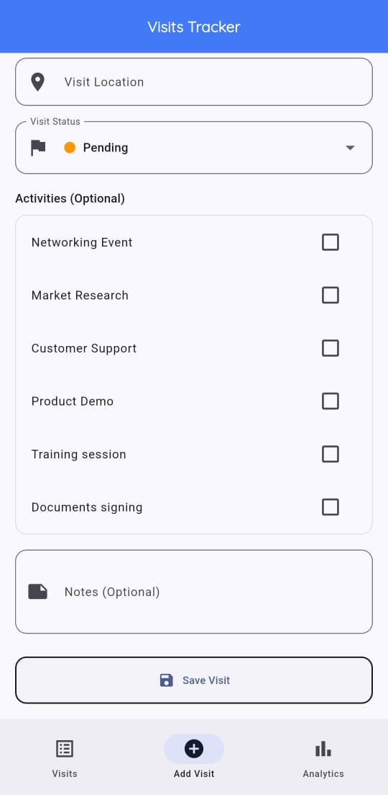

# Events Solutech - Visits Tracker App

A comprehensive Flutter application for tracking customer visits and activities with beautiful analytics.

## 🔗 GitHub Repository

[https://github.com/innocentmayemuhavi/events_solutech](https://github.com/innocentmayemuhavi/events_solutech)

## 🚀 Quick Start

Get the app running in 3 simple steps:

```bash
# 1. Clone the repository
git clone https://github.com/innocentmayemuhavi/events_solutech.git
cd events_solutech

# 2. Install dependencies
flutter pub get

# 3. Run the app
flutter run
```

## 📱 Overview

Events Solutech Flutter application designed to help businesses track and manage customer visits efficiently. The app provides an intuitive interface for recording visits, viewing visits, and analyzing visit patterns through comprehensive analytics.

### Key Features

- 📋 **Visit Management**: Create, view, and manage customer visits with detailed information
- 📊 **Activity Tracking**: Record specific activities performed during visits
- 📈 **Analytics Dashboard**: Beautiful ux and ui and statistics with progress indicators
- 🌓 **Adaptive Theming**: Supports both light and dark themes following system settings
- 🎨 **Material 3 Design**: Modern UI with consistent design language
- 🔍 **Search Mechanism**: Search mechanism to ensure easy to find visits using state,name,location etc.

- 💯 clean code architecture to ensure easy scalling and updating of codebase

## 📸 Screenshots

### Visits List Dark Mode


### Visits List Light Mode



### Analytics dark theme


### Analytics dark theme


### Analytics dark theme



### Analytics Light theme


### Analytics Light theme


### Analytics Light theme



### Add Visit Form Dark mode



### Add Visit Form Dark mode



### Add Visit Form Light mode



### Add Visit Form Light mode



## 🏗️ Architecture & Key Decisions

### State Management

- **Provider Pattern**: Chosen for its simplicity and tight integration with Flutter and its easy to scale and optimised
- **Separation of Concerns**: Different providers for visits, customers, and activities,this also helps in debuging,scalling and optimisation.
- **Reactive UI**: Automatic updates when data changes using `Consumer` widgets to ensure instant update accordingly to data state

## 🎬 Animations & Visual Effects

The app features animations to enhance user experience:

### Animation Types Implemented

#### **Progress Bar Animations**

- **Smooth Progress Bars**: Custom animated progress indicators with rounded corners
- **Staggered Loading**: Progress bars animate with different timing for visual appeal
- **Elastic Curves**: Using `Curves.easeInOut` for natural motion

#### **Card Animations**

- **Scale Animations**: Stats cards animate in with elastic bounce effects
- **Staggered Entrance**: Cards appear with incremental delays (0ms, 100ms, 200ms, 300ms)
- **Transform Scale**: Using `TweenAnimationBuilder` for smooth scaling effects

#### **Page Transitions**

- **Loading States**: Animated loading indicators while data loads

#### **Interactive Elements**

- **List Item Animations**: Smooth animations when adding new visits

## 🔄 CI/CD Implementation

### Overview

This project implements CI/CD pipeline using GitHub Actions to ensure code quality, automated testing, and streamlined deployment processes.

### Implemented Workflows

#### **1. Continuous Integration Pipeline (`dart.yml`)**

**Summary**: I have implemented GitHub Actions workflow for CI/CD. The workflow automatically runs on pushes and pull requests to the main, master, and develop branches.

### Steps include:

- checking out code,
  - setting up Java and Flutter,
  - installing dependencies,
  - verifying code formatting,
  - analyzing the project,
  - running tests with coverage,
  - and uploading results.
    The build job also creates a release APK artifact for Android when code is pushed.

Automatically runs on every push to `main`/`develop` branches and all pull requests:

```yaml
# Workflow triggers
on:
  push:
    branches: [main, develop]
  pull_request:
    branches: [main]
```

**Pipeline Steps:**

- ✅ **Code Checkout**: Retrieves the latest code from the repository
- ✅ **Environment Setup**: Configures Java 17 and Flutter SDK with caching enabled
- ✅ **Dependency Installation**: Runs `flutter pub get` to install all project dependencies
- ✅ **Code Formatting**: Executes `dart format` to ensure consistent code style
- ✅ **Static Analysis**: Runs `flutter analyze` to detect potential code issues
- ✅ **Automated Testing**: Executes `flutter test` with coverage reporting
- ✅ **Build Verification**: Creates debug APK to verify the app builds successfully
- ✅ **Artifact Storage**: Uploads the generated APK as a downloadable artifact
